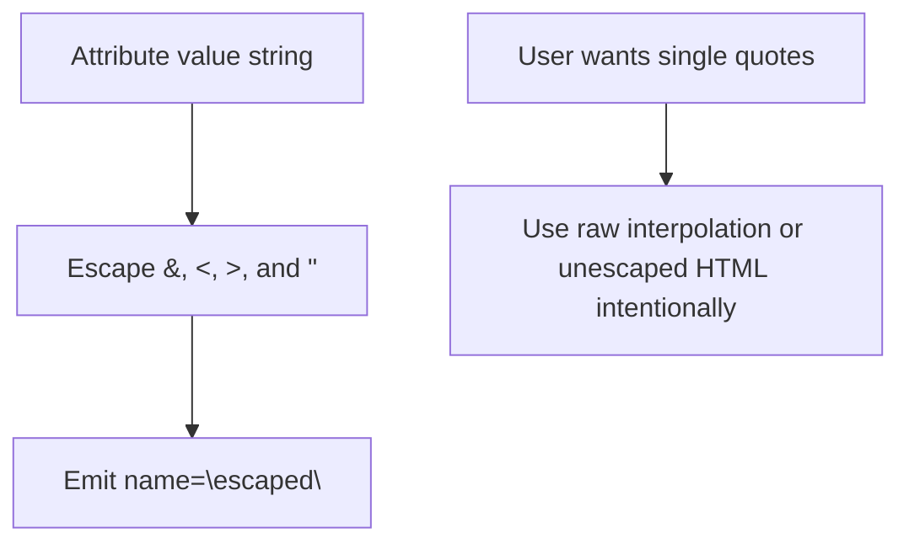

# HTML Attribute Quoting and Escaping

## The problem

HTML attribute values can be delimited by `"` or `'`. Hotmetal-generated attributes should use one consistent convention: **always emit double-quoted attributes**. Given that convention, hotmetal must ensure user-controlled data cannot terminate the current double-quoted value and inject new attributes or markup.

The classic failure mode is a **delimiter/escape mismatch**:

```html
<!-- delimiter is ", but " in value is not escaped -->
<div title="foo" onclick="alert(1)">
         ^ breakout: new attribute injected
```

A subtler mistake is letting delimiter choice and escaping drift apart. If an escaping function assumes double-quoted attributes, then all hotmetal-owned attribute emitters must keep using double quotes.

**Important nuance:** when hotmetal fixes the delimiter to `"`, only `"` is required for quote-breakout prevention. Apostrophes can remain literal:

| Hotmetal delimiter | Must escape | Safe to leave literal |
|--------------------|-------------|------------------------|
| `"` | `"`, `&`, `<` | `'` |

`>` is recommended by OWASP but is not a delimiter-exit vector in normal quoted attributes.

## Current hotmetal behavior

Your in-progress changes already move in the right direction:

- [`attr()`](core/src/main/scala/hotmetal/Html.scala) and [`attrNotNull()`](core/src/main/scala/hotmetal/Html.scala) always emit **double-quoted** values.
- [`escapeHtmlAttr`](core/src/main/scala/hotmetal/HtmlUtils.scala) escapes `& < > " '` (but not `/`).

That is **secure**, but **over-escapes apostrophes** for readability:

```scala
// today (with your diff)
"title" := "Joe's Diner"   // emits: title="Joe&apos;s Diner"

// desired
"title" := "Joe's Diner"   // emits: title="Joe's Diner"
```

Relevant emission sites (all should share one helper):

```63:70:core/src/main/scala/hotmetal/Html.scala
  def attrNotNull(name: String, value: String): Unit =
    if value != null then
      append(' ')
      append(name)
      append('=')
      append('"')
      append(Html.escapeAttr(value))
      append('"')
```

```202:208:core/src/main/scala/hotmetal/Html.scala
  def attr(name: String, value: String)(using html: Html): Unit =
    html.append(' ')
    html.append(name)
    html.append('=')
    html.append('"')
    html.append(Html.escapeAttr(value))
    html.append('"')
```

## Recommended solution: always double-quoted emission

Since hotmetal should always generate double-quoted attributes, prefer a simpler policy: **emit `name="value"` everywhere, and escape only characters dangerous in a double-quoted attribute context**.



### Algorithm

1. `attr()` and `attrNotNull()` always emit the attribute delimiter as `"`.
2. `Html.escapeAttr` / `HtmlUtils.escapeHtmlAttr` escape `&`, `<`, `>`, and `"`.
3. `Html.escapeAttr` / `HtmlUtils.escapeHtmlAttr` leave `'` and `/` literal.

Examples:

- `Joe's Diner` -> `title="Joe's Diner"`
- `12" screen` -> `size="12&quot; screen"`
- `He "said" it's fine` -> `title="He &quot;said&quot; it's fine"`

This covers hotmetal-generated attributes without allowing delimiter exit. If a user wants single-quoted attributes, they can deliberately write that markup themselves through interpolation / unescaped output and own the escaping contract for that custom syntax.

### API shape

Keep the existing public shape:

```scala
def escapeAttr(value: CharSequence): CharSequence
// double-quoted attribute context: escapes &, <, >, and "

def attr(name: String, value: String)(using Html): Unit
// emits name="escaped"
```

`escapeAttr` should be documented as specifically suitable for **hotmetal's double-quoted attribute values**, not for arbitrary single-quoted or unquoted attribute syntaxes.

### What we should NOT do

- **Add smart delimiter selection** - it improves readability for values containing `"`, but makes generated markup less predictable and complicates snapshot expectations.
- **Expose delimiter + escape as separate public steps** - easy footgun (`escapeForSingleQuote` paired with `"` delimiter).
- **Support unquoted attribute values** for dynamic data — requires escaping spaces and many more characters; high risk, low value.
- **Change text-node escaping** (`escapeHtml`) — apostrophes in text content are a different context; leave as-is.

## Alternative approaches (and why not primary)

| Approach | Pros | Cons |
|----------|------|------|
| Always `"` delimiter, escape only `"` | Chosen design: predictable markup, readable apostrophes, simple invariant | Values with `"` become `&quot;` entities |
| Always escape both quotes (current diff) | Very simple and conservative | Ugly `&apos;` everywhere in double-quoted attrs |
| Smart delimiter selection | Maximizes readability for both quote types | Content-dependent quote style, harder snapshots, more moving parts |
| Context-aware interpolator attrs | Could improve raw `html"""<div id="$x">"""` output | Requires macro/HTML-parser awareness; separate, larger project |

## Related gap: interpolator attribute context

The `html` interpolator treats all interpolations as **text content** escaping ([`Html.Impl.appendExpr`](core/src/main/scala/hotmetal/Html.scala) always calls `escape()`, not `escapeAttr()`).

Example from tests:

```117:125:core/src/test/scala/hotmetal/HtmlSuite.scala
  test("Interpolate html tag parameter"):
    val div = Html:
      val i = 1
      html"""<div id="$i">${"hello'"}</div>"""
    // <div id="1">hello&apos;</div>
```

- `id="$i"` is safe for simple values because `escape()` still encodes `"`.
- It over-escapes `'` in attribute position and does not skip `/` the way `escapeAttr` does.
- **Policy recommendation:** document that dynamic attributes should use `"name" := value` / `attr()`, not raw interpolator holes inside literal tags. A future macro improvement could enforce this, but it is out of scope for the quoting fix.

## Test plan

Extend [`HtmlSuite.scala`](core/src/test/scala/hotmetal/HtmlSuite.scala):

| Case | Input value | Expected output fragment |
|------|-------------|--------------------------|
| Apostrophe only | `Joe's` | `title="Joe's"` |
| Double-quote only | `12"` | `size="12&quot;"` |
| Both quotes | `He "x" y's` | `data="He &quot;x&quot; y's"` |
| Breakout attempt | `a" onclick="alert(1)` | `title="a&quot; onclick=&quot;alert(1)"` |
| Apostrophe injection-shaped value | `a' onclick='alert(1)` | `title="a' onclick='alert(1)"` |
| URL path | `/login` | `href="/login"` (still no `/` escaping) |
| Ampersand | `a&b` | `data="a&amp;b"` |

Add one test via [`HtmlElements`](core/src/main/scala/hotmetal/HtmlElements.scala) (`attrNotNull` path) to confirm both emission sites behave identically.

## Implementation scope

Files to touch:

- [`core/src/main/scala/hotmetal/HtmlUtils.scala`](core/src/main/scala/hotmetal/HtmlUtils.scala) — update attribute escaping to leave `'` literal while still escaping `"`.
- [`core/src/main/scala/hotmetal/Html.scala`](core/src/main/scala/hotmetal/Html.scala) — keep `attr` / `attrNotNull` emitting double quotes and using `Html.escapeAttr`.
- [`core/src/test/scala/hotmetal/HtmlSuite.scala`](core/src/test/scala/hotmetal/HtmlSuite.scala) — cases above; update existing `escapeAttr` tests for the new apostrophe behavior.

No changes to `HtmlElements.scala` if `attrNotNull` is fixed centrally.

## Security invariant (document in code)

> **Invariant:** hotmetal-owned attributes are always emitted as double-quoted values, and a double quote from user-controlled data is never emitted literally inside that value.

This invariant prevents the "exit attribute scope" attack for hotmetal-generated attributes. Apostrophes are safe to emit literally because they do not terminate a double-quoted attribute value.
